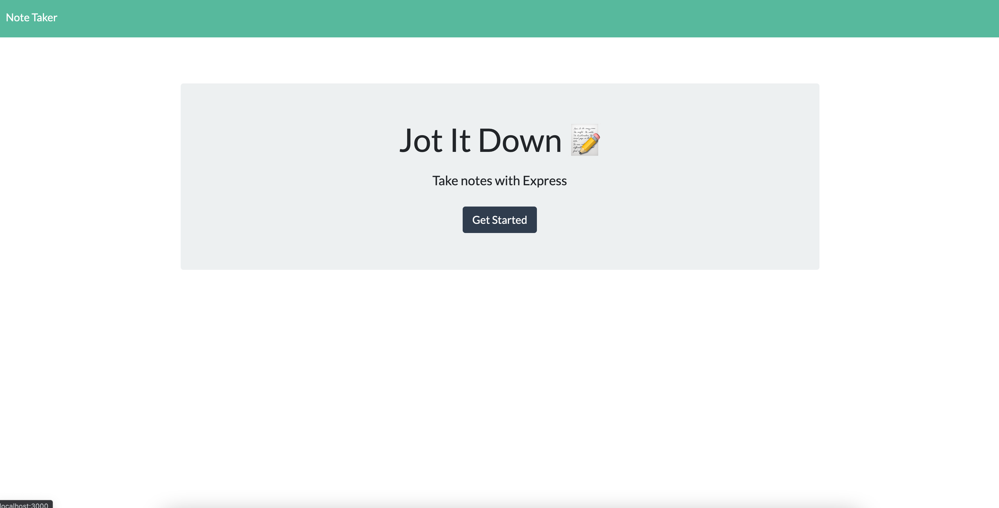
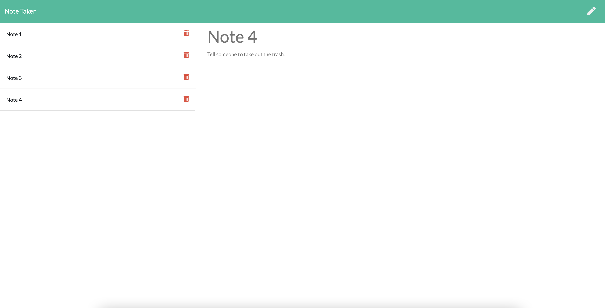

    <h3 align="center">Jot It Down</h3>
     
    

    Jot it or forget it!
     
     
    <a href="https://jot-it-down-by-wdfhai.herokuapp.com/">View Demo</a>
    

 

    
Table of Contents

    <ol>
        <li><a href="#about-the-project">Description</a></li>
        <li><a href="#built-with">Built With</a></li></li>
        <li><a href="#installation">Installation</a></li>
        <li><a href="#usage">Usage</a></li>
        <li><a href="#contributing">Contributing</a></li>
        <li><a href="#license">License</a></li>
        <li><a href="#contact">Contact</a></li>
        <li><a href="#summary">Summary</a></li>
    </ol>

### Description

This application helps the user generate and manage notes.

### Built With

Following languages, frameworks and libraries were used in the development of this project:

- HTML,CSS,JavaScript
- Bootstrap,NodeJS,others

### Installation

There are no installs required to use this application. However, to edit the code you will need Node, NPM, Express and Nodemon(recommended).

### Usage

From the landing page, navigate to the Notes page. There you will have the option to either create a new note or read/delete existing notes.

### Contributing

Contributions are what make the open source community such an amazing place to learn, inspire, and create. Any contributions you make are **greatly appreciated**.

1. Fork the Project
2. Create your Feature Branch
3. Commit your Changes
4. Push to the Branch
5. Open a Pull Request

### License

This project is using the following license: MIT

### Contact

You can reach me for any questions or comments at the following:

- Look me up on Github, where my username is <a href="https://github.com/wdfhai">wdfhai</a>.
- Reach out to me through email at wd.fhai@outlook.com.
- Find me on Twitter at @wdfhai.

### Summary

I hope you enjoy using my note taking app. Cheers!
